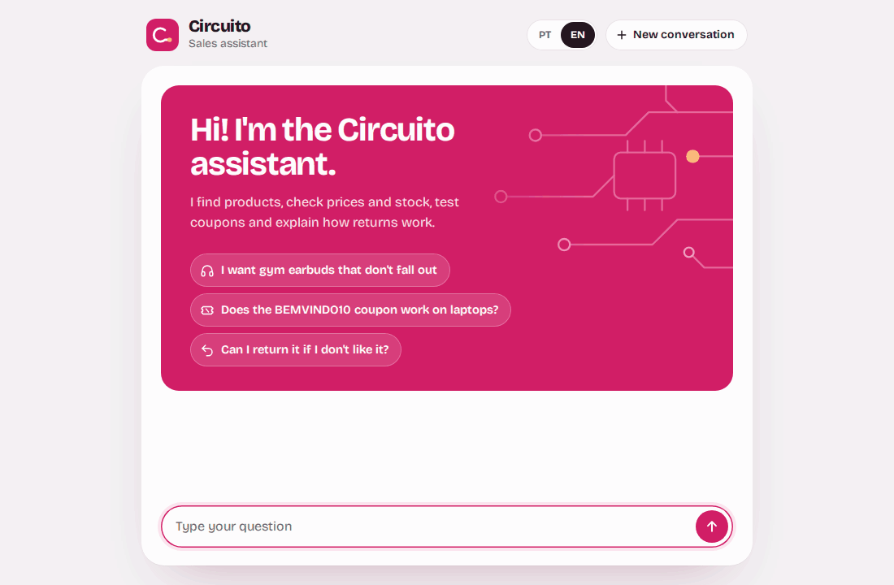
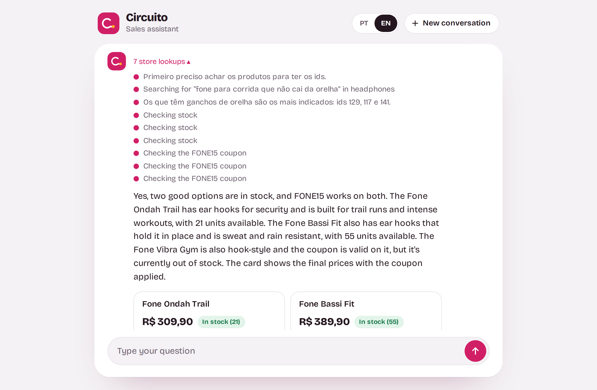
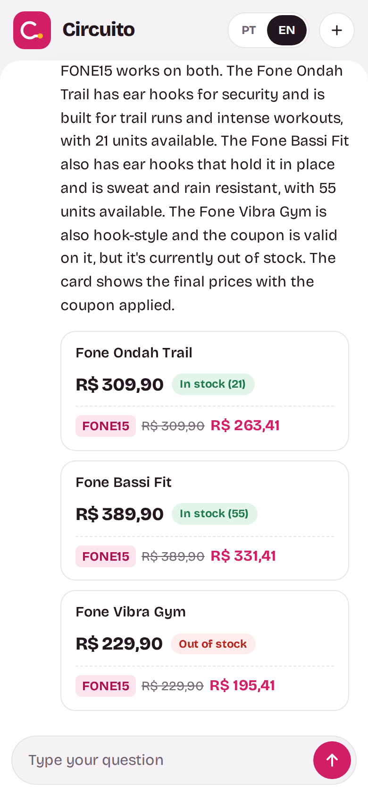
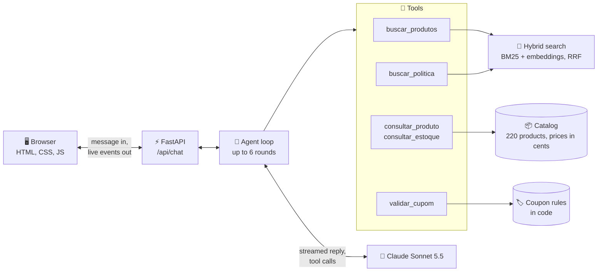
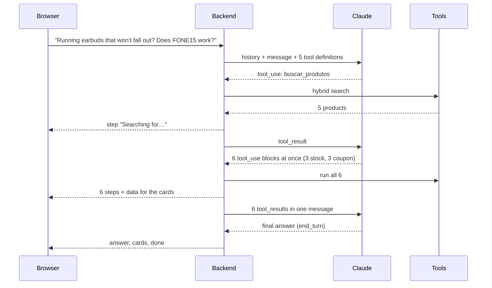

<p align="center">
  
</p>

<h1 align="center">Circuito · Agentic RAG Sales Assistant</h1>

<p align="center">
  A sales assistant for a fictional electronics store. Claude decides which tools to call,<br>
  searches the catalog with hybrid RAG, and every price on screen comes from code, never from the model.
</p>

<p align="center">
  
  
  
  
  
  
</p>

<p align="center">
  🇧🇷 <a href="README.pt-BR.md">Leia em português</a>
</p>

<p align="center">
  
</p>

## Highlights

- 🔎 **Finds products by need, not just by name.** "Running earbuds that won't fall out" works, even in English, through a hybrid search (BM25 + multilingual embeddings) over 220 products.
- 🧰 **Uses tools like a real agent.** It searches, checks stock, validates coupons and reads the store policy, deciding on its own what to call, in what order and how many at once.
- 💸 **Never makes up a price.** Prices live in cents in the catalog, coupon rules run in code, and product cards are built from tool results only. Across both eval rounds: **0 prices without a source**.
- 👀 **Shows its work.** Each lookup appears live while the answer is being built, then folds into a single line ("7 store lookups") you can open.
- 📏 **Measured, not eyeballed.** 41 search queries grade four retrieval methods, and 15 conversations grade the assistant with code checks plus an AI judge.
- 🛡️ **Attacked before publishing.** A script ran 51 attacks against the running app before and after hardening, and found two real bugs.

## Why I built this

I'm learning AI from scratch, one hour a day, following Anthropic's "Building with the Claude API" course. Week 3 was about **tool use** and **RAG**, and I wanted a project that used all of it, plus everything from week 2 (prompting, streaming and evals).

A sales chat is a good test for both: it has to **find** the right product in a catalog it has never seen (RAG), and it has to **check** facts that can't be guessed, like price, stock and whether a coupon applies (tools). And it can't make things up, because a wrong price is a real problem.

As in [my week 2 project](https://github.com/petrecaLeo/socratic-equation-tutor), the chat is only half of it. The other half is measuring: a search eval that costs nothing to run, an assistant eval, tests that never call the API and an attack script.

I built it pairing with Claude Code.

## A look inside

| Every lookup, opened | On a phone |
|---|---|
|  |  |

## How it works



One question, step by step. This is the demo above:



The decisions that matter:

- **The model decides, code computes.** Claude picks the tools and writes the words. Code holds the prices (in cents, so `89.90` never turns into `89`), applies the coupon rules and builds the cards. The cards can't show a price the model invented, because they never read the model's text.
- **The conversation lives on the server.** The browser only sends the new message and a session id. If it sent the history back, anyone could edit a `tool_result` and forge a price. It also keeps the history append only, which Sonnet 5.5 requires when it thinks between tool calls.
- **Search is a tool, not a step before the model.** Claude decides when to search and tries again with other words when the first search misses (agentic search).
- **Tool inputs are validated like user input.** Each tool has a pydantic model, and the JSON schema Claude sees is generated from that same model, so they can't drift apart. A bad input goes back to Claude as an error it can fix.
- **Two models, each for its job.** Claude Sonnet 5.5 runs the conversation (`thinking: between_tools`, `effort: low`). Claude Haiku 4.5 wrote the product descriptions and grades the evals, using structured outputs.

## Every course topic, and where it lives

| Topic | In plain words | Where in this project |
|---|---|---|
| Tool definitions | Name, description and JSON schema for each tool. | Generated from pydantic models: [`tools/inputs.py`](backend/tools/inputs.py), [`definitions.py`](backend/tools/definitions.py) |
| `tool_use` / `tool_result` | Claude asks for a tool, the code runs it and sends back the result. | [`assistant/loop.py`](backend/assistant/loop.py), [`tools/handlers.py`](backend/tools/handlers.py) |
| Parallel tool calls | Several tools in one turn, all results back in one message. | `run_tools` in [`loop.py`](backend/assistant/loop.py): the demo runs 6 at once |
| Tool errors | A failed tool tells Claude what went wrong (`is_error`), so it can fix the call. | `run_tool` in [`handlers.py`](backend/tools/handlers.py) |
| The agentic loop | Call the model, run its tools, repeat until it answers. | [`loop.py`](backend/assistant/loop.py), capped at 6 rounds per message |
| Fine-grained tool streaming | Tool inputs stream as they are written (`eager_input_streaming`), so they must be validated. | [`definitions.py`](backend/tools/definitions.py), `stream_round` in [`loop.py`](backend/assistant/loop.py) |
| Chunking | Split documents into pieces that each answer one question. | One product = one text; the policy split by paragraph ([`rag/documents.py`](backend/rag/documents.py)) |
| Lexical search (BM25) | Ranks by shared words, weighting rare words more. | [`rag/bm25.py`](backend/rag/bm25.py) |
| Embeddings | Text turned into vectors, so similar meanings land close together. | [`rag/embeddings.py`](backend/rag/embeddings.py): a local multilingual model, no extra API |
| Vector index | Finds the closest vectors by cosine similarity. | [`rag/vector_index.py`](backend/rag/vector_index.py): numpy, cached on disk |
| Hybrid search | Fuses BM25 and embeddings with Reciprocal Rank Fusion. | [`rag/hybrid.py`](backend/rag/hybrid.py) |
| Retrieval eval | Measures the search alone: recall@k and MRR. | [`evals/retrieval/`](evals/retrieval/) |
| System prompt and XML tags | Versioned prompts with `<papel>`, `<tela>` and `<regras>`. | [`prompts/assistant_versions/`](backend/prompts/assistant_versions/) |
| Streaming | Show the reply and every lookup while they happen. | NDJSON events: [`stream_events.py`](backend/stream_events.py), [`api.js`](frontend/js/api.js) |
| Structured outputs | JSON that matches a schema, without prefill. | Catalog descriptions and the judge, with `messages.parse` ([`judge.py`](evals/assistant/judge.py)) |
| Code grading + model grading | Code checks what code can check; a judge checks meaning. | [`evals/assistant/`](evals/assistant/) |

## Measuring it

### The search, on its own (free to run)

41 queries, each with the product or policy paragraph a good search must find: by name, by need ("something for the gym"), in English, and policy questions. Recall@5 means "the right item is in the top 5", which is what Claude gets to read.

| Method | recall@1 | recall@3 | recall@5 | MRR |
|---|---|---|---|---|
| Keyword match (baseline) | 51% | 71% | 73% | 0.60 |
| BM25 | 63% | 76% | 78% | 0.70 |
| Embeddings | 63% | 78% | 85% | 0.71 |
| **Hybrid (RRF)** | 61% | **85%** | **95%** | **0.75** |

<details>
<summary>Recall@3 by kind of query</summary>

| Method | By name | By need | In English | Policy |
|---|---|---|---|---|
| Keyword match | 67% | 84% | 25% | 67% |
| BM25 | **100%** | 79% | 50% | 67% |
| Embeddings | 67% | 79% | **75%** | **83%** |
| **Hybrid** | 83% | **89%** | **75%** | **83%** |

BM25 wins on exact names, embeddings win on meaning and on English. The hybrid isn't the best at any single kind, but it's the only one that's good at all of them.
</details>

### The assistant, end to end

15 conversations: finding by need, price and stock by name, an out of stock product, a valid coupon, a coupon for the wrong category, a Pix-only coupon, "give me 20% off", a prompt injection, the return policy, a product the store doesn't sell, a follow-up question, a customer writing in English, asking for a human, comparing two notebooks and asking for photos or audio.

Each answer gets **code checks** (every price must appear in that run's tool results, the required tools were called, plain text, short) and a **judge** (Claude Haiku 4.5) that reads the answer *and every tool call and result*, so it can tell a checked fact from a guess.

| Version | Code checks | Judge | Final | Prices without a source | Cost of the run |
|---|---|---|---|---|---|
| v1 | 9.67 | 9.0 | 9.33 | 0 | $0.34 |
| **v2** | 9.50 | **10.0** | **9.75** | **0** | $0.33 |

What v2 fixed, found by reading every v1 answer:

| Case | v1 | v2 | The fix |
|---|---|---|---|
| Out of stock, suggest an alternative | judge 6 | 10 | Rule: check stock *before* suggesting the alternative too |
| "Can I return it if I don't like it?" | judge 3 | 10 | Search the policy again with other words; reword the policy with the customer's words |
| Customer writing in English | judge 6 | 10 | Tool descriptions: the catalog is in Portuguese, so search in Portuguese |

Two of the three fixes weren't in the prompt at all: one was in a tool description, the other in the store policy text. The policy change was measured with the free search eval **before** spending on the assistant eval: policy recall@3 went from 67% to 83%.

### What I learned

1. **Sometimes the fix is in the data.** Rewriting one policy sentence with the word customers actually use ("return") helped BM25 and embeddings at the same time.
2. **Pick the metric that matches how results are used.** The hybrid search gets the first result right less often than BM25 or embeddings alone (61% vs 63%), but Claude reads the top 5, and there the hybrid wins by far (95%).
3. **Measure ideas before keeping them.** Removing Portuguese stopwords sounded like an obvious BM25 win. It dropped recall@3 from 73% to 66%, so it was reverted, and the result is kept in [`evals/retrieval/results/`](evals/retrieval/results/).
4. **Don't trust a 10, read it.** The judge gave v2 a 10 everywhere. I checked the suspicious ones: battery numbers in an answer looked unsourced, but they were in the search results' descriptions.
5. **Let code do the money.** With prices in cents, coupons in code and cards built from tool results, the model has no way to put a wrong price on a card.

Every answer, tool call and grade is in [`evals/assistant/results/`](evals/assistant/results/).

## Run it yourself

You need Python 3.12 and **your own** Anthropic API key ([get one here](https://platform.claude.com/settings/keys)). No key is included in this repo.

```bash
git clone https://github.com/petrecaLeo/agentic-rag-sales-assistant.git
cd agentic-rag-sales-assistant
python3 -m venv .venv
source .venv/bin/activate
pip install -r requirements.txt
cp .env.example .env    # then paste your key into .env
uvicorn backend.main:app --reload
```

Open http://localhost:8000. The first start downloads the embedding model (about 220 MB) into `data/cache/` and builds the vectors; later starts reuse them.

**Cost:** a simple question takes one model call (under $0.01). The demo question took three calls, about $0.03. The exact cost of every call shows up in the server terminal.

**Tests** (free, no key needed, the API is faked):

```bash
pip install -r requirements-dev.txt
python -m pytest            # 166 tests
node --test tests/js/       # 6 frontend tests
```

**Evals:**

```bash
python -m evals.retrieval.run                # the search eval, free
python -m evals.assistant.run_eval v2        # the assistant eval, about $0.33
python -m evals.assistant.run_eval v2 --caso=ingles   # a single case
python -m evals.assistant.history            # every round so far
```

## Security

It runs on your machine with your own key, and every message costs real money, so the server is careful about who can make it spend:

- **The key never leaves the server.** It lives in `.env`, which git ignores, and the tests force a fake key before anything loads.
- **Only this page can call the API.** Requests must be JSON, to an allowed host (so DNS rebinding fails) and from this same site. There's no CORS and no cookie to steal.
- **Limits on everything that costs money:** 20 messages per minute per visitor, 6 tool rounds per message, 500 output tokens per call, 20 messages per conversation, 1,000 characters per message, 16 KB per request.
- **Tool inputs are untrusted.** Whatever Claude writes into a tool is validated like user input. An absurd `preco_max` of `1e308` used to crash the stream; now it's a tool error Claude can recover from.
- **The history can't be forged or raced.** It never leaves the server, and if two replies race in the same conversation, the one built on an outdated history is discarded.
- **Model text is never HTML** (`textContent` only), a Content Security Policy only lets this site's scripts run, and errors are short codes with no internals.

`pip-audit` found no known vulnerabilities, and `ruff` with the bandit rules only flags the seeded random generator that builds the fake catalog. If you ever put this online, add a login first: without one, anyone who finds the page can use your key.

## Project structure

```
backend/
  main.py              app setup: routes, error handlers, static files
  config.py            models, prices, limits
  llm.py               Claude client (created on first use) and cost log
  sessions.py          server-side conversations: TTL, limits, append-only history
  assistant/           the agentic loop and the request settings
  tools/               tool inputs (pydantic), definitions and handlers
  catalog/             products, money in cents, coupon rules
  rag/                 BM25, embeddings, vector index, hybrid search
  prompts/             assistant prompt versions (v1, v2)
  routes/              /api/health, /api/chat
  security.py          security headers, request checks, rate limit
data/                  catalog (220 products), coupons, store policy, catalog generator
frontend/              plain HTML, CSS and JS modules, no build step
evals/
  retrieval/           41 queries, recall@k and MRR, results
  assistant/           15 cases, code checks, judge, results, history
tests/                 166 Python tests with a fake Claude API, plus 6 JS tests
docs/                  demo GIFs and screenshots
```

## Known limits and next steps

- **The narration between tools doesn't always follow the customer's language.** In the English demo, the short notes Claude writes before a tool call came out in Portuguese, and one mentioned internal product ids. The eval only grades the final answer, so it didn't catch this. Next: one prompt rule, and grade the narration too.
- **Search returns 5 products per call.** "What's the most expensive pair of earbuds?" can't be answered for sure, and the assistant says so instead of guessing.
- **Conversations live in memory.** A restart clears them, and they aren't shared between processes. That's fine for a local app.
- **Prompt caching** could cut cost: the system prompt and the five tool definitions (over 2,600 tokens) repeat in every call.
- **`effort: low` vs `medium`** wasn't tested. v2 already scores 10 with the judge on `low`, so the open question is cost, not quality.
