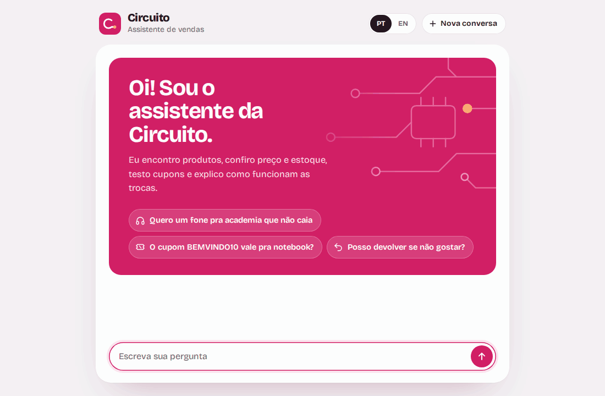
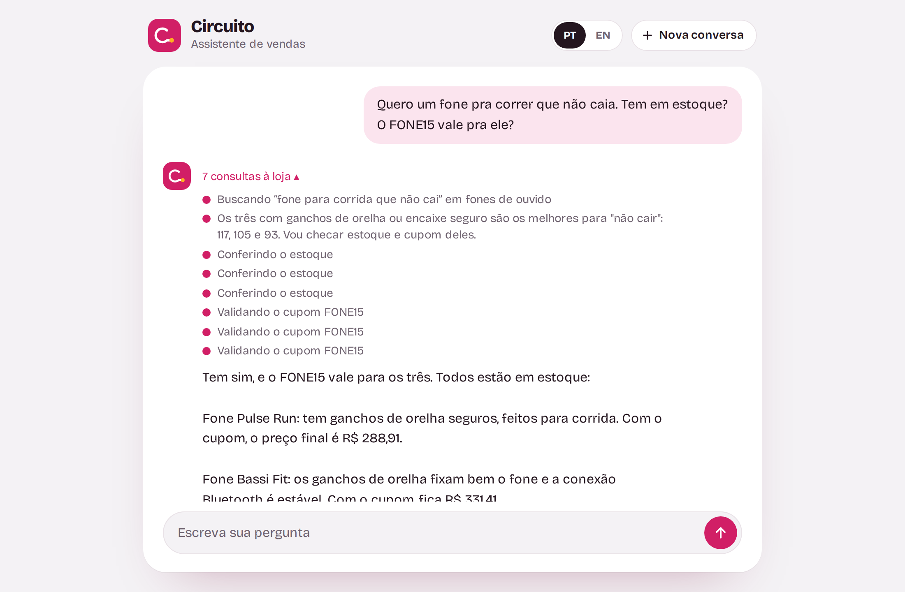
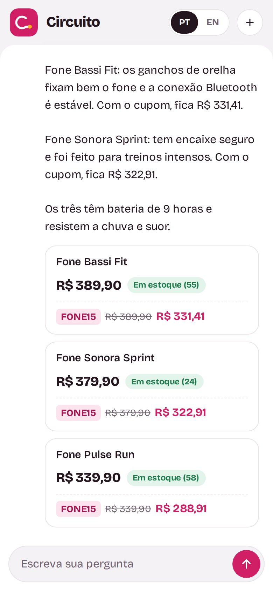
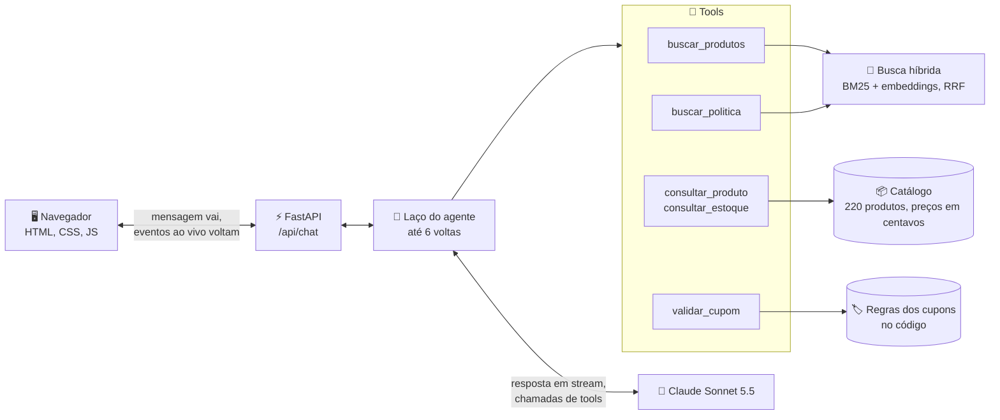
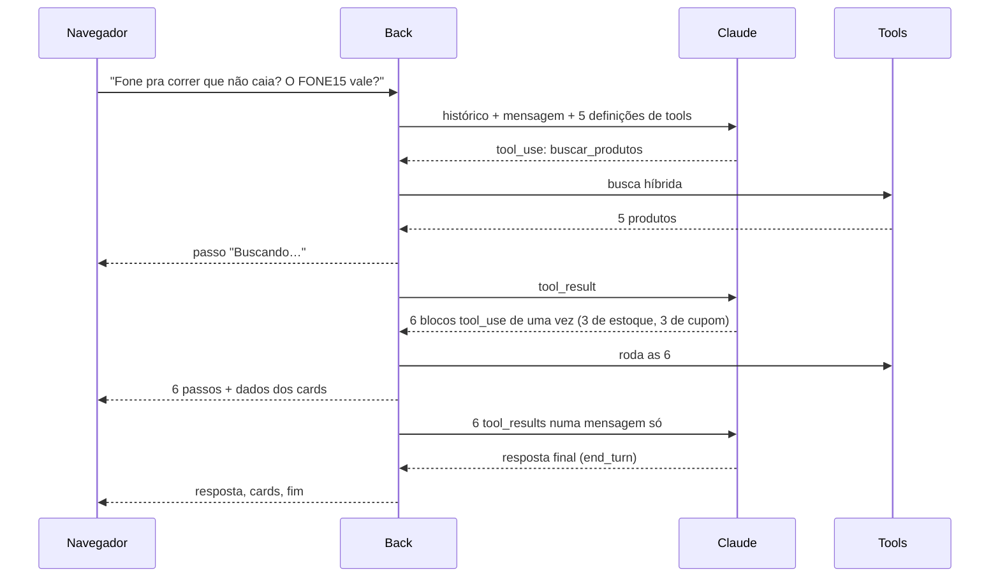

<p align="center">
  
</p>

<h1 align="center">Circuito · Assistente de vendas com RAG agêntico</h1>

<p align="center">
  Um assistente de vendas para uma loja de eletrônicos fictícia. O Claude decide quais ferramentas usar,<br>
  busca no catálogo com RAG híbrido, e todo preço na tela vem do código, nunca do modelo.
</p>

<p align="center">
  
  
  
  
  
  
</p>

<p align="center">
  🇺🇸 <a href="README.md">Read in English</a>
</p>

<p align="center">
  
</p>

## Destaques

- 🔎 **Acha produtos pela necessidade, não só pelo nome.** "Fone pra correr que não caia" funciona, até em inglês, com uma busca híbrida (BM25 + embeddings multilíngues) em 220 produtos.
- 🧰 **Usa ferramentas como um agente de verdade.** Busca, confere estoque, valida cupons e lê a política da loja, decidindo sozinho o que chamar, em que ordem e quantas de uma vez.
- 💸 **Nunca inventa preço.** Os preços ficam em centavos no catálogo, as regras dos cupons rodam no código, e os cards de produto saem só dos resultados das ferramentas. Nas duas rodadas da eval: **0 preços sem fonte**.
- 👀 **Mostra o que está fazendo.** Cada consulta aparece ao vivo enquanto a resposta é montada e, no fim, vira uma linha só ("7 consultas à loja") que abre com um clique.
- 📏 **Medido, não no olho.** 41 buscas avaliam quatro métodos de busca, e 15 conversas avaliam o assistente com checagens de código mais um juiz de IA.
- 🛡️ **Atacado antes de publicar.** Um script fez 51 ataques contra o app rodando, antes e depois das correções, e achou dois bugs reais.

## Por que eu fiz

Estou aprendendo IA do zero, uma hora por dia, com o curso "Building with the Claude API" da Anthropic. A semana 3 foi sobre **tool use** e **RAG**, e eu queria um projeto que usasse tudo isso, mais tudo da semana 2 (prompts, streaming e evals).

Um chat de vendas testa bem as duas coisas. Ele precisa **achar** o produto certo num catálogo que nunca viu (RAG) e **conferir** o que não dá para adivinhar, como preço, estoque e se um cupom vale (tools). E não pode inventar nada, porque um preço errado é um problema de verdade.

Como no [meu projeto da semana 2](https://github.com/petrecaLeo/socratic-equation-tutor), o chat é só metade. A outra metade é medir: uma eval da busca que não custa nada, uma eval do assistente, testes que nunca chamam a API e um script de ataques.

Construí em par com o Claude Code.

## Por dentro

| Todas as consultas, abertas | No celular |
|---|---|
|  |  |

## Como funciona



Uma pergunta, passo a passo. É a do GIF acima:



As decisões que importam:

- **O modelo decide, o código calcula.** O Claude escolhe as tools e escreve o texto. O código guarda os preços (em centavos, para `89,90` nunca virar `89`), aplica as regras dos cupons e monta os cards. Um card não tem como mostrar um preço inventado pelo modelo, porque nunca lê o texto dele.
- **A conversa fica no servidor.** O navegador manda só a mensagem nova e o id da sessão. Se ele devolvesse o histórico, qualquer pessoa poderia editar um `tool_result` e forjar um preço. Isso também mantém o histórico só com acréscimos, o que o Sonnet 5.5 exige quando pensa entre as chamadas de tools.
- **A busca é uma tool, não uma etapa antes do modelo.** O Claude decide quando buscar e tenta de novo com outras palavras quando a primeira busca falha (busca agêntica).
- **A entrada das tools é validada como entrada de usuário.** Cada tool tem um modelo pydantic, e o JSON schema que o Claude vê é gerado desse mesmo modelo, então os dois não divergem. Uma entrada ruim volta para o Claude como um erro que ele consegue corrigir.
- **Dois modelos, cada um no seu trabalho.** O Claude Sonnet 5.5 conduz a conversa (`thinking: between_tools`, `effort: low`). O Claude Haiku 4.5 escreveu as descrições dos produtos e é o juiz das evals, com structured outputs.

## Cada tópico do curso, e onde ele está

| Tópico | Em palavras simples | Onde neste projeto |
|---|---|---|
| Definição de tools | Nome, descrição e JSON schema de cada tool. | Gerado dos modelos pydantic: [`tools/inputs.py`](backend/tools/inputs.py), [`definitions.py`](backend/tools/definitions.py) |
| `tool_use` / `tool_result` | O Claude pede uma tool, o código roda e devolve o resultado. | [`assistant/loop.py`](backend/assistant/loop.py), [`tools/handlers.py`](backend/tools/handlers.py) |
| Tools em paralelo | Várias tools numa volta, todos os resultados numa mensagem só. | `run_tools` em [`loop.py`](backend/assistant/loop.py): o GIF roda 6 de uma vez |
| Erros de tool | Uma tool que falha diz ao Claude o que deu errado (`is_error`), e ele corrige a chamada. | `run_tool` em [`handlers.py`](backend/tools/handlers.py) |
| O laço do agente | Chama o modelo, roda as tools dele, repete até ele responder. | [`loop.py`](backend/assistant/loop.py), com no máximo 6 voltas por mensagem |
| Fine-grained tool streaming | A entrada das tools chega enquanto é escrita (`eager_input_streaming`), então precisa ser validada. | [`definitions.py`](backend/tools/definitions.py), `stream_round` em [`loop.py`](backend/assistant/loop.py) |
| Chunking | Dividir documentos em pedaços que respondem uma pergunta cada. | Um produto = um texto; a política dividida por parágrafo ([`rag/documents.py`](backend/rag/documents.py)) |
| Busca lexical (BM25) | Ordena por palavras em comum, dando mais peso às raras. | [`rag/bm25.py`](backend/rag/bm25.py) |
| Embeddings | Texto vira vetor, e significados parecidos ficam perto. | [`rag/embeddings.py`](backend/rag/embeddings.py): um modelo multilíngue local, sem outra API |
| Índice vetorial | Acha os vetores mais próximos pela similaridade de cosseno. | [`rag/vector_index.py`](backend/rag/vector_index.py): numpy, com cache em disco |
| Busca híbrida | Junta BM25 e embeddings com Reciprocal Rank Fusion. | [`rag/hybrid.py`](backend/rag/hybrid.py) |
| Eval da busca | Mede só a busca: recall@k e MRR. | [`evals/retrieval/`](evals/retrieval/) |
| System prompt e tags XML | Prompts versionados com `<papel>`, `<tela>` e `<regras>`. | [`prompts/assistant_versions/`](backend/prompts/assistant_versions/) |
| Streaming | Mostrar a resposta e cada consulta enquanto acontecem. | Eventos NDJSON: [`stream_events.py`](backend/stream_events.py), [`api.js`](frontend/js/api.js) |
| Structured outputs | JSON no formato de um schema, sem prefill. | Descrições do catálogo e o juiz, com `messages.parse` ([`judge.py`](evals/assistant/judge.py)) |
| Nota por código + nota por modelo | O código confere o que dá para conferir; um juiz confere o sentido. | [`evals/assistant/`](evals/assistant/) |

## Medindo

### A busca, sozinha (rodar não custa nada)

41 buscas, cada uma com o produto ou o parágrafo da política que uma boa busca precisa achar: pelo nome, pela necessidade ("algo pra academia"), em inglês e dúvidas de política. Recall@5 quer dizer "o item certo está entre os 5 primeiros", que é o que o Claude lê.

| Método | recall@1 | recall@3 | recall@5 | MRR |
|---|---|---|---|---|
| Palavras em comum (base) | 51% | 71% | 73% | 0,60 |
| BM25 | 63% | 76% | 78% | 0,70 |
| Embeddings | 63% | 78% | 85% | 0,71 |
| **Híbrido (RRF)** | 61% | **85%** | **95%** | **0,75** |

<details>
<summary>Recall@3 por tipo de busca</summary>

| Método | Pelo nome | Pela necessidade | Em inglês | Política |
|---|---|---|---|---|
| Palavras em comum | 67% | 84% | 25% | 67% |
| BM25 | **100%** | 79% | 50% | 67% |
| Embeddings | 67% | 79% | **75%** | **83%** |
| **Híbrido** | 83% | **89%** | **75%** | **83%** |

O BM25 ganha nos nomes exatos, e os embeddings ganham no sentido e no inglês. O híbrido não é o melhor em nenhum tipo sozinho, mas é o único bom em todos.
</details>

### O assistente, de ponta a ponta

15 conversas: busca pela necessidade, preço e estoque pelo nome, produto esgotado, cupom válido, cupom de outra categoria, cupom só no Pix, "me dá 20% de desconto", injeção de prompt, política de devolução, produto que a loja não vende, pergunta de continuação, cliente escrevendo em inglês, pedido de atendente humano, comparação de dois notebooks e pedido de foto ou áudio.

Cada resposta passa por **checagens de código** (todo preço precisa aparecer nos resultados das tools daquela execução, as tools obrigatórias foram chamadas, texto puro, resposta curta) e por um **juiz** (Claude Haiku 4.5) que lê a resposta *e cada chamada e resultado de tool*, para separar um fato conferido de um chute.

| Versão | Código | Juiz | Final | Preços sem fonte | Custo da rodada |
|---|---|---|---|---|---|
| v1 | 9,67 | 9,0 | 9,33 | 0 | US$ 0,34 |
| **v2** | 9,50 | **10,0** | **9,75** | **0** | US$ 0,33 |

O que o v2 corrigiu, achado lendo cada resposta do v1:

| Caso | v1 | v2 | A correção |
|---|---|---|---|
| Esgotado, sugerir alternativa | juiz 6 | 10 | Regra: conferir o estoque *antes* de sugerir a alternativa também |
| "Se eu não gostar, posso devolver?" | juiz 3 | 10 | Buscar na política de novo com outras palavras; reescrever a política com as palavras do cliente |
| Cliente escrevendo em inglês | juiz 6 | 10 | Descrição das tools: o catálogo está em português, então a busca é em português |

Duas das três correções nem estavam no prompt: uma estava na descrição de uma tool, e a outra no texto da política da loja. A mudança na política foi medida com a eval da busca, que é grátis, **antes** de gastar com a eval do assistente: o recall@3 da política foi de 67% para 83%.

### O que eu aprendi

1. **Às vezes a correção está nos dados.** Reescrever uma frase da política com a palavra que o cliente usa ("devolver") ajudou o BM25 e os embeddings ao mesmo tempo.
2. **Escolha a métrica que combina com o uso.** A busca híbrida tem o *menor* recall@1, mas o Claude lê os 5 primeiros, e aí o híbrido ganha com folga (95%).
3. **Meça a ideia antes de ficar com ela.** Tirar as stopwords do português parecia uma vitória óbvia para o BM25. O recall@3 caiu de 73% para 66%, então a mudança foi desfeita, e o resultado ficou guardado em [`evals/retrieval/results/`](evals/retrieval/results/).
4. **Não confie num 10, leia.** O juiz deu 10 para o v2 em tudo. Conferi os suspeitos: os números de bateria de uma resposta pareciam sem fonte, mas estavam nas descrições dos resultados da busca.
5. **Deixe o dinheiro com o código.** Com preços em centavos, cupons no código e cards montados dos resultados das tools, o modelo não tem como pôr um preço errado num card.

Cada resposta, chamada de tool e nota está em [`evals/assistant/results/`](evals/assistant/results/).

## Rode na sua máquina

Você precisa do Python 3.12 e da **sua** chave da API da Anthropic ([crie aqui](https://platform.claude.com/settings/keys)). Nenhuma chave vem neste repositório.

```bash
git clone https://github.com/petrecaLeo/agentic-rag-sales-assistant.git
cd agentic-rag-sales-assistant
python3 -m venv .venv
source .venv/bin/activate
pip install -r requirements.txt
cp .env.example .env    # depois cole a sua chave no .env
uvicorn backend.main:app --reload
```

Abra http://localhost:8000. Na primeira vez, o servidor baixa o modelo de embeddings (uns 220 MB) para `data/cache/` e monta os vetores; nas próximas, reaproveita.

**Custo:** uma pergunta simples faz uma chamada ao modelo (menos de US$ 0,01). A pergunta do GIF fez três chamadas, uns US$ 0,03. O custo exato de cada chamada aparece no terminal do servidor.

**Testes** (grátis, sem chave, com a API falsa):

```bash
pip install -r requirements-dev.txt
python -m pytest            # 166 testes
node --test tests/js/       # 6 testes do front
```

**Evals:**

```bash
python -m evals.retrieval.run                # a eval da busca, grátis
python -m evals.assistant.run_eval v2        # a eval do assistente, uns US$ 0,33
python -m evals.assistant.run_eval v2 --caso=ingles   # um caso só
python -m evals.assistant.history            # todas as rodadas
```

## Segurança

O app roda na sua máquina com a sua chave, e cada mensagem custa dinheiro de verdade. Então o servidor toma cuidado com quem pode fazer ele gastar:

- **A chave nunca sai do servidor.** Ela fica no `.env`, que o git ignora, e os testes forçam uma chave falsa antes de qualquer coisa carregar.
- **Só esta página chama a API.** O pedido precisa ser JSON, ir para um host permitido (o que barra DNS rebinding) e vir deste mesmo site. Não tem CORS liberado nem cookie para roubar.
- **Limite em tudo que custa dinheiro:** 20 mensagens por minuto por visitante, 6 voltas de tools por mensagem, 500 tokens de saída por chamada, 20 mensagens por conversa, 1.000 caracteres por mensagem e 16 KB por pedido.
- **A entrada das tools não é confiável.** O que o Claude escreve numa tool é validado como entrada de usuário. Um `preco_max` absurdo de `1e308` derrubava o stream; agora vira um erro de tool do qual o Claude se recupera.
- **O histórico não pode ser forjado nem atropelado.** Ele nunca sai do servidor, e se duas respostas correrem na mesma conversa, a que partiu de um histórico velho é descartada.
- **Texto do modelo nunca vira HTML** (só `textContent`), um Content Security Policy só deixa rodar os scripts do próprio site, e os erros são códigos curtos, sem detalhes internos.

O `pip-audit` não achou vulnerabilidades conhecidas, e o `ruff` com as regras do bandit só aponta o gerador aleatório com semente que monta o catálogo fictício. Se um dia isto for para a internet, ponha um login antes: sem ele, qualquer pessoa que achar a página usa a sua chave.

## Estrutura do projeto

```
backend/
  main.py              montagem do app: rotas, erros, arquivos estáticos
  config.py            modelos, preços, limites
  llm.py               cliente do Claude (criado no primeiro uso) e log de custo
  sessions.py          conversas no servidor: TTL, limites, histórico só com acréscimos
  assistant/           o laço do agente e os parâmetros da chamada
  tools/               entradas das tools (pydantic), definições e handlers
  catalog/             produtos, dinheiro em centavos, regras dos cupons
  rag/                 BM25, embeddings, índice vetorial, busca híbrida
  prompts/             versões do prompt do assistente (v1, v2)
  routes/              /api/health, /api/chat
  security.py          cabeçalhos de segurança, checagem dos pedidos, limite por minuto
data/                  catálogo (220 produtos), cupons, política da loja, gerador do catálogo
frontend/              HTML, CSS e módulos JS puros, sem build
evals/
  retrieval/           41 buscas, recall@k e MRR, resultados
  assistant/           15 casos, checagens de código, juiz, resultados, histórico
tests/                 166 testes de Python com uma API do Claude falsa, mais 6 testes de JS
docs/                  GIFs e screenshots
```

## Limites conhecidos e próximos passos

- **A narração entre as tools nem sempre segue o idioma do cliente.** Na demo em inglês, as notas curtas que o Claude escreve antes de chamar uma tool saíram em português, e uma citou ids internos dos produtos. A eval só avalia a resposta final, então não pegou isso. Próximo passo: uma regra no prompt, e avaliar a narração também.
- **A busca traz 5 produtos por chamada.** "Qual é o fone mais caro?" não tem resposta garantida, e o assistente diz isso em vez de chutar.
- **As conversas ficam na memória.** Reiniciar apaga todas, e elas não são divididas entre processos. Para um app local, tudo bem.
- **Prompt caching** poderia baixar o custo: o system prompt e as cinco definições de tools (mais de 2.600 tokens) se repetem em toda chamada.
- **`effort: low` contra `medium`** não foi testado. O v2 já tira 10 com o juiz no `low`, então a dúvida que sobra é de custo, não de qualidade.
